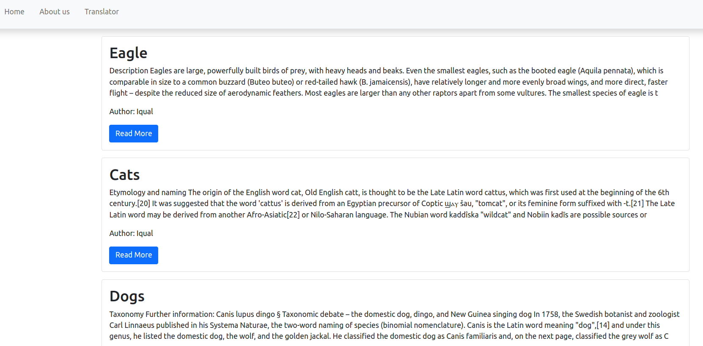
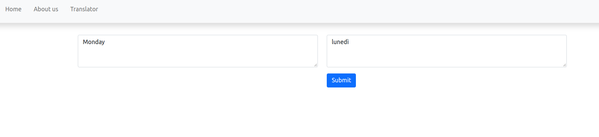

# DjangoBlogTranslator
This is a repository for the Blog and translator web app project. The web application also contain Translator section and Admin section.

## Desktop application that I used for coding part
```
Visual Studio Code
```

## Frontend part
```
Bootstrap
```

## Library used for creating the Translator section
```
Googletrans
```

## Framework used for deploying the Web App
```
Django
```

## Web hosting service
```
[Python anywhere](https://www.pythonanywhere.com)
```

## Web application link
```
[Blog and Translator App](https://blog-translator-app.pythonanywhere.com)
```

## App idea:
```
App created according to the Udemy lesson by Ardit Sulce.
```
## App Images:
 <br>
 <br>

